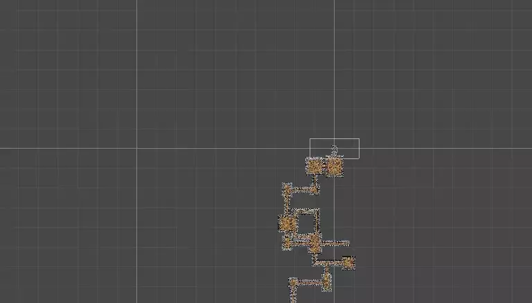
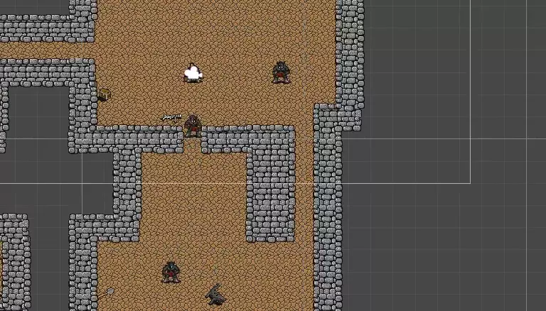

# Procedural Dungeon Generation

This repo implements and extends upon the ideas presented in the
[Unity 2D Random Dungeon Generator for a Roguelike Video Game](https://www.udemy.com/course/unity-2d-random-dungeon-generator-for-a-roguelike-video-game/) 
Udemy course.

Features implemented:

- Cheapo 2D "animations" using tile flipping (looking left and right),
- Automatic wall placement around floor tiles using a self-deleting spawner object,
- Rounded corners on top of base sprites using bitmasking techniques for prefab selection,
- Level generation using
  - Plain random walks ("caverns" mode),
  - Constrained random walks and
  - Random rooms generation ("rooms" and "winding" mode),
- Random item and enemy placement,
- Enemy patrols using random walks and player chasing using A* pathfinding.

A random level in the editor:

Game view:

Generating levels:

Pathfinding in effect:

